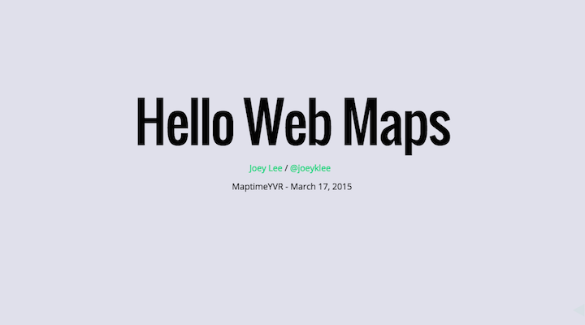
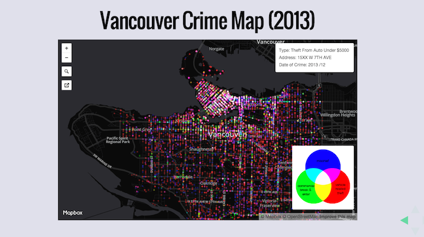
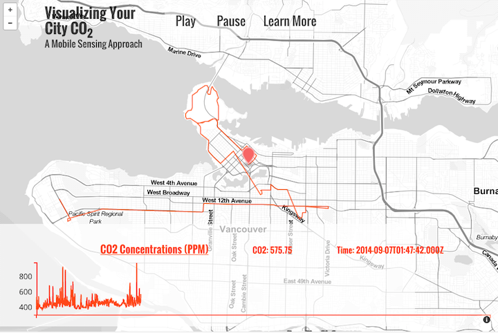
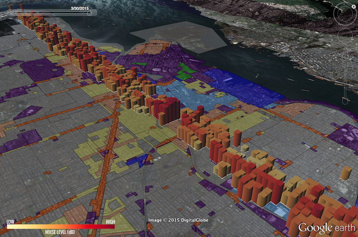
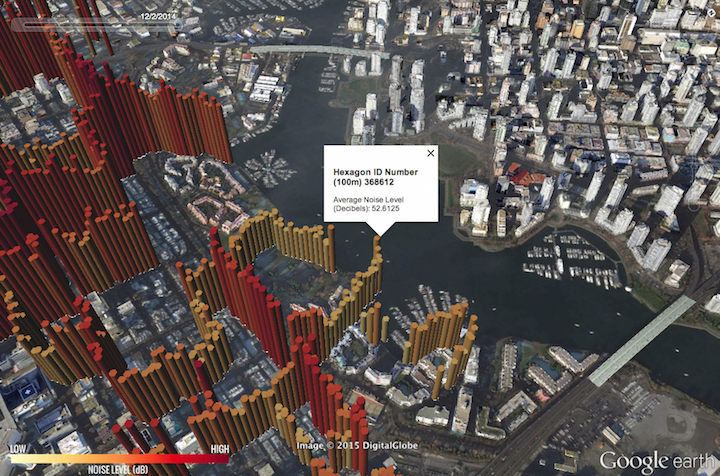
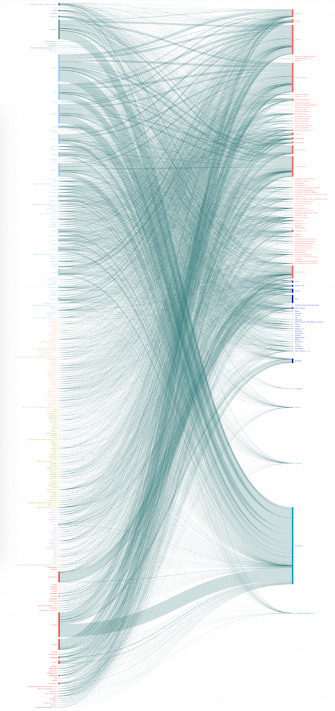

# Call for Data Viz Applications

To : Geography Faculty

## What
This is a call to faculty interested in incorporating data visualization into his/her curriculum. 

( Or for those just interested in chatting about possibilities... )

 
## Why
Data visualization in the form of charts, animations, and interactive graphics and maps can be an effective way of helping communicate your research and your course material to your students.

By allowing students to visually explore data built from qualitative and quantitative research, we might offer students new ways of understanding course material and the work that you do.

Furthermore, many data visualizations can and are built for the web, helping to "modernize" the experience of learning and help to increase accessibility.

 
## How
We can meet with you to discuss your data and visualization ideas, and options for inclusion of visualizations in lectures, and/or student involvement in a course assigment or project for capturing data, visualizing data, analysis of data (see examples below).

Data visualization can take many forms, some are listed below:

* ###"Interactives":
	* Charts
	* Maps
	* Web pages
	* Animations
	* (or a combination of the above)
* ###"Data Art":
	* Abstract representations of information to convey impressions or feelings

 
## Who
Joey Lee is interested in helping to develop visualizations with professors and teaching staff looking to enagage their students (or other researchers or grant organizations) with new media. Joey Lee is currently a 2nd year Master's student in Geography, previously working in data visualization at MIT. His CV is located [here](http://files.cargocollective.com/531027/lee_joseph_cv_2015_01.pdf) and his portfolio, [here](http://jk-lee.com/).

 
## Examples
### Interactive Map Making Workshop
As part of a TerreWEB workshop, Joey developed a workshop for students to learn how to make an [interactive map for the web](https://joeyklee.github.io/hellowebmaps/#/). Students from departments all across campus from Land and Food Systems, Geography, SCARP, etc participated in the 2 hour workshop. At the end of the exercise, each student was able to produce a map visualizing Vancouver's crime data for 2013. 

 
### TerreWEB Openhouse 2014 - Animating CO2 in Vancouver
As part of the TerreWEB Openhouse (2014), Joey developed a visualization of co2 data measured by a mobile CO2 monitoring platform in Vancouver. The interactive allows users to pause and play the visualization as viewers trace the variability in pollution across the city.
  

 
### GEOG 311: Urban Environments - Noise Mapping Exercise
In collaboration with Andreas Christen and Sally Hermansen, Joey helped to develop a Google Earth based visualization that allowed the GEOG 311 students to visualize and interact with the noise data they collected as part of a field work exercise/assignment. The students were able to experience "crowdsourcing" a dataset and then interact with the data they collected. Furthermore the students were also able to visualize other contextual data such as Vancouver's land use data, census data, and transit routes to help explain patterns or trends they measured during their measurement campaign. 

 
### Academy of Urban Super-Diversity, Berlin (2015) - Vancouver Diversity Visualization
Working together with Dan Heibert, Joey and Dan developed this visualization of ethnic and religious diversity in Vancouver. The chart draws  connections between the different ethnicities and their respective religious affiliations, giving an impression of the diversity and connectivity of these groups in Vancouver. 

This was shown at the Academy of Urban Super-Diversity conference in Berlin, Germany (2015).

 
###Community Based Research Courses
Working with courses like Sally's data viz CBR course, we can help faculty with ideas for deliverables back to the community for visualizing the project results in the form of infographics.

 
## When
Joey will be available now for meetings and discussions of projects, and will be available to work on projects starting September 2015 until the Spring 2016 on a contract basis.

***

## Contact
###Joey Lee

joseph.lee@geog.ubc.ca

###Sally Hermansen

sally.hermansen@ubc.ca

