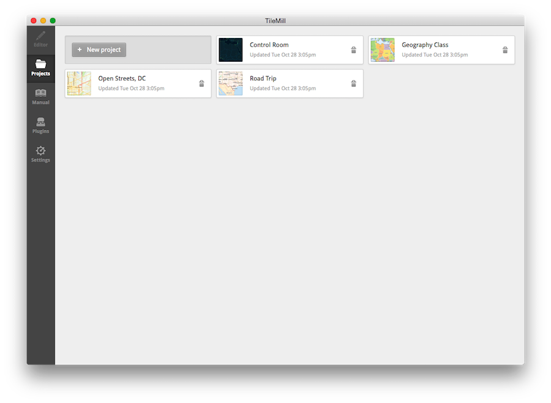
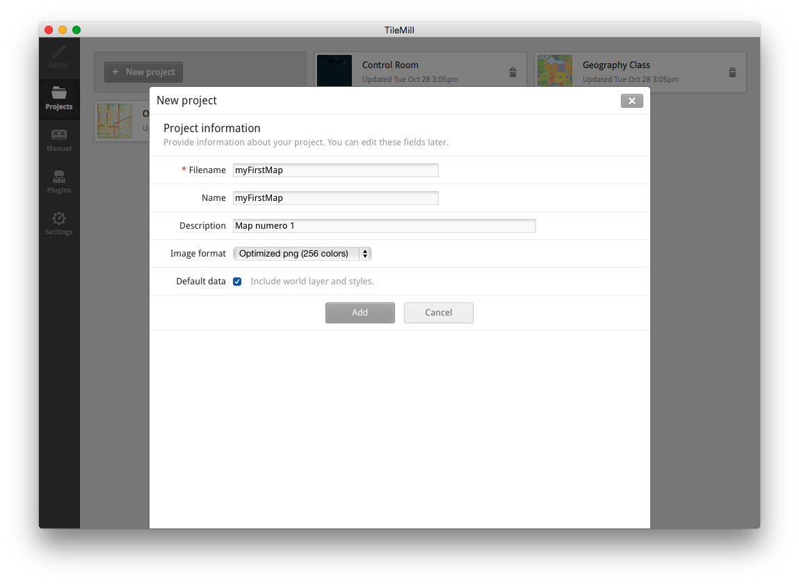

# Let's Make a Map!
***
## Getting Started:
1. ### Fire up Tilemill!
	The Tilemill interface looks like this:
	

2. ### Start a new project
	Click 'New project' and you will get pop-up window as shown below. Add in the name and description (optional) and  click 'Add'. I typically use the 8-bit png (256 colors), but you may choose to use a higher res png (full color) or jpeg tiles.
	

3. ### Enter Tilemill
	Now that we've got our Tilemill project running, let's do a tour of the interface.
	

 
## References:
+ [Lyzi Diamond's nice presentation](http://lyzidiamond.com/leaflet/#1) - covers the basics of maptiles and creating your first leaflet project
+ [Mapbox tutorial for making your first map](https://www.mapbox.com/tilemill/docs/crashcourse/introduction/) - this is where it all started for me...