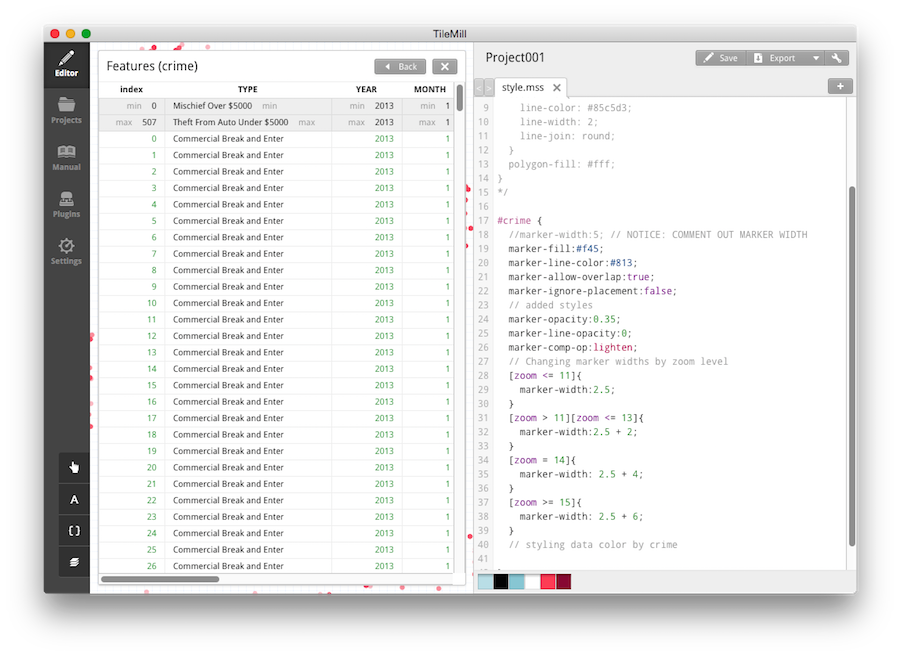

# Styling Data: Part II
===
## Overview
Now that we are familiar with **Tilemill** & **Mapbox**, let's take our Tilemill skills a bit further by styling different our crime data based on the **type of crime** that was committed. Let's also change the **size of the points** depending on the zoom level to enhance their **visibility**.

## Ready, go!
1. ### Start Tilemill
Open up Tilemill and navigate to the **crime project** we completed following the steps in the "Tutorial" folder. My project is called "Project001".
	

2. ### Before we dive in
Take a look at the existing style for our crime data. It should look like this:
         
         #crime {
           marker-width:5; // changed marker size
           marker-fill:#f45;
           marker-line-color:#813;
           marker-allow-overlap:true;
           marker-ignore-placement:false;
           // added styles
           marker-opacity:0.35;
           marker-line-opacity:0;
           marker-comp-op:lighten;
        } 

	Our current project allows us to zoom from zoom level 11 to level 15, so let's increase the size of our marker at each zoom level so the visibility is enhanced. 

	To do this, let's introduce the 'zoom' parameter and the signs of inequality. Remember these symbols?

	+ less than (<)
	+ greater than (>)
	+ less than or equal to (<=)
	+ greater than or equal to (>=)
	
	

3. ### Style marker-width by zoom level
	To practice using the various combinations of styling zoom levels, let's do the following to the markers at each zoom level. ** This is just pseudo code to plan out how we will style the marker-width**.
	
	+ For zoom level less than or equal to 11: 
		+ marker-width: 2.5
	+ For zoom level greater than 11 but less than or equal to 13:
		+ marker-width: 2.5 + 2
	+ For zoom level 14:
		+ marker-width: 2.5 + 4
	+ For zoom leve greater than or equal to 15:
		+ marker-width: 2.5 + 6
	
	 
	This translated into code looks like this. Notice a few things here: (copy and paste if you'd like!)
	
	1. **comment out** marker-width at the top - since we're not using this one anymore, let's just comment it out!
	2. The zoom levels are referenced within a set of **brackets** [ ]
	3. You ***specify the range** by putting the zoom levels by pairing the zoom levels next to each other (e.g. [zoom >=12][zoom <=14])
	4. The marker-width property and value are **contained within a set of mustache tags** { }
	5. After the marker-width value, we use a ";" to signify the end of the value. **note: It's easy to forget these semi-colons, so be wary!**
	6. I've chosen to increase the marker width size by 2, 4, and 6 from the original marker size. This is just my way to keeping track of the up-scaling, but you can develop the way that works best for you!
	 
	
         #crime {
           // marker-width:5; // NOTICE: COMMENT OUT MARKER WIDTH
           marker-fill:#f45;
           marker-line-color:#813;
           marker-allow-overlap:true;
           marker-ignore-placement:false;
           // added styles
           marker-opacity:0.35;
           marker-line-opacity:0;
           marker-comp-op:lighten;
           // Changing marker widths by zoom level
           [zoom <= 11]{
              marker-width:2.5;
           }
           [zoom > 11][zoom <= 13]{
              marker-width:2.5 + 2;
           } 
           [zoom = 14]{
              marker-width: 2.5 + 4;
           }
           [zoom >= 15]{
              marker-width: 2.5 + 6;
           }
        } // closing bracket 
        
     Here's what you might find after you've done this - notice the points are larger than they were before! How cool!   
     
     
4. ### Styling Data by Attributes
	Right now all of the crimes are red, but not all crimes are created equal. So, let's go ahead and change the colors of the crimes based on the type of crime that was committed.
	
	**Start** by examing the data to find the field that specifies the crime of the data. To do this, click on the layers icon  and then click the icon that looks like a little data table:
	
	
	And we will see a spreadsheet like structure:
	
	
	And cool! We now know that the name of the key that holds the crime type is called "TYPE" - that's intuitive!
	
	 
	
	**Next** We know from the crime data provided by the [City of Vancouver](http://vancouver.ca/news-calendar/from-mischief-to-theft-vancouver-s-crime-data-for-2003-to-2011-now-available-for-download.aspx) that the types of crimes available are:

        Mischief under $5,000
        Mischief over $5,000
        Theft from auto under $5,000
        Theft from auto over $5,000
        Theft of auto under $5,000
        Theft of auto over $5,000
        Commercial break and enter
 
 	So with the combination of "TYPE" and the crimes listed above, we can now style our data!
 	   
 	**Plan**: Similar to how we planned how to change the marker size for each zoom level, let's think of specific colors to assign each crime: **again this is pseudocode**.
 	
 	**Notice:**: 1. we're using hex color codes to specify the colors 2. the **lighten(<hexcode>, <%>)** & **darken(<hexcode>, <%>)** function allows us to lighten a specified color by a certain percentage. A handy tool for managing your color palette!
		 
	
	    Blue for Mischief
        	Mischief under $5,000: lighten(#0000FF, 10%)
        	Mischief over $5,000: #0000FF
        Red for Theft FROM auto:
        	Theft from auto under $5,000: lighten(#FF0000, 10%)
        	Theft from auto over $5,000: #FF0000
        Darker Red for Theft OF Auto:
        	Theft of auto under $5,000: darken(#FF0000, 10%)
        	Theft of auto over $5,000: darken(#FF0000, 20%)
        Green for Commercial break and enter:
        	Commercial break and enter: #00FF00
    
   **So let's style it!**
		
		#crime {
           // marker-width:5; // NOTICE: COMMENT OUT MARKER WIDTH
           marker-fill:#f45;
           marker-line-color:#813;
           marker-allow-overlap:true;
           marker-ignore-placement:false;
           // added styles
           marker-opacity:0.35;
           marker-line-opacity:0;
           marker-comp-op:lighten;
           // Changing marker widths by zoom level
           [zoom <= 11]{
              marker-width:2.5;
           }
           [zoom > 11][zoom <= 13]{
              marker-width:2.5 + 2;
           } 
           [zoom = 14]{
              marker-width: 2.5 + 4;
           }
           [zoom >= 15]{
              marker-width: 2.5 + 6;
           }
           // styling data color by crime
           ['TYPE' = 'Mischief Under $5000']{
			  marker-fill:lighten(#0000FF, 10%);
			}
		   ['TYPE' = 'Mischief Over $5000']{
		      marker-fill: #0000FF;
		   }
		   ['TYPE' = 'Theft From Auto Under $5000']{
		      marker-fill: lighten(#FF0000, 10%);
		   }
		   ['TYPE' = 'Theft from auto over $5000']{
			  marker-fill: #FF0000;
		   }
		   ['TYPE' = 'Theft Of Auto Under $5000']{
		      marker-fill: lighten(#CC33FF, 10%);
		   }
		   ['TYPE' = 'Theft Of Auto Over $5000']{
		      marker-fill: #CC33FF;
		   }
		   ['TYPE' = 'Commercial Break and Enter']{
		      marker-fill: #00FF00;
		   }
		} // crime closing bracket
   
   
   We should end up with something like this - Cool, RGB disco party!:
   
 	  
5. ### We've done it! We've styled our data based on the specific values we wanted! 
The cool thing is that because we've used the RGB color combination, we can see based on the colors of the points where combinations of crimes where geolocated to the same spot. So our legend might look something like this:

	
   
6. ### Adding a legend:
[The Mapbox legends tutorial](https://www.mapbox.com/tilemill/docs/guides/advanced-legends/) goes over how to add your legend, so I won't go over it extensively. 

	Basically we do is:
	+ Make an image in photoshop (or your favorite image making environment) with the RGB circles and added the text
	+ Resized the legend to around 150px x 150px
	+ Followed the steps from the [The Mapbox legends tutorial](https://www.mapbox.com/tilemill/docs/guides/advanced-legends/)  to convert an image (e.g. the legend png) to a base-64 encoded image.
	+ Pasted [this code](data/legends.txt) into the Legend section of the 'Templates'.
	+ and Voila! a legend! 
	       
	      
	Now we should have something like this:
	  

7. ### Export/Upload your map to Mapbox, give it a baselayer in Mapbox, and share it with the world!
